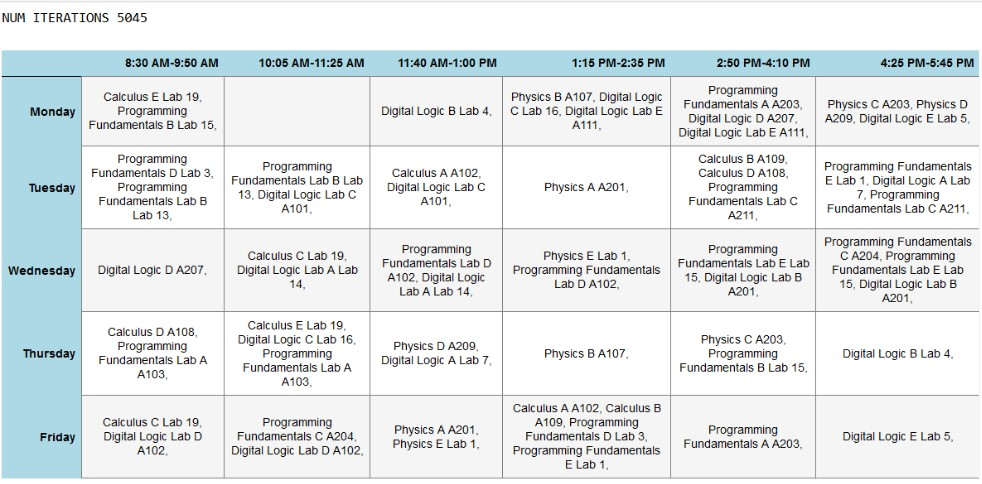

# Timetable Scheduling with Genetic Algorithm

This project applies a genetic algorithm to solve the timetable scheduling problem. The algorithm generates feasible timetables by evolving a population of candidate schedules through selection, crossover, and mutation processes.

## Project Overview

### Problem Statement

The goal is to schedule courses, sections, professors, and rooms into timeslots while adhering to various constraints. The problem is modeled as a genetic algorithm optimization task where the fitness of each timetable is evaluated based on constraint satisfaction.

### Input Data

The input is read from five CSV files:
- `Course.csv`: Contains course details.
- `Section.csv`: Contains section details.
- `Professors.csv`: Contains professor details.
- `Rooms.csv`: Contains room details.
- `Timeslots.csv`: Contains timeslot details.

### Chromosome Representation

Each chromosome represents a single course section to be scheduled and is formatted as follows:

CCCCCCCCT_RRRRRRRR_PPPPPPPP_SSSSSSSSSSSSSSSSSSSSSSSSSSSSSSS

Where:
- `CCCCCCCCT`: 8 bits for the course.
- Next 1 bit: Type of course.
- `RRRRRRRR`: 8 bits for the room.
- `PPPPPPPP`: 8 bits for the professor.
- `SSSSSSSSSSSSSSSSSSSSSSSSSSSSSS`: 30 bits for 6 slots over 5 days.

### Genetic Algorithm Workflow

1. **Initialization**: A population of timetables (chromosomes) is generated from the input data.
2. **Fitness Calculation**: Fitness is evaluated based on hard constraints. Penalties are added for each constraint violation and the inverse of the penalty is used for minimization.
3. **Selection**: Individuals are selected based on their fitness.
4. **Crossover**: New offspring (children) are generated through crossover of selected individuals.
5. **Mutation**: Children undergo mutation to introduce genetic diversity.
6. **Replacement**: The population is updated by including new children and culling to maintain a constant population size.

### Example Configuration

- **Population Size**: 10
- **Max Generations**: 1 million
- **Mutation Chance**: 0.3

### Results

The genetic algorithm's progress and results are visualized in the image below. This image illustrates the outcome of the scheduling problem after running the algorithm.

